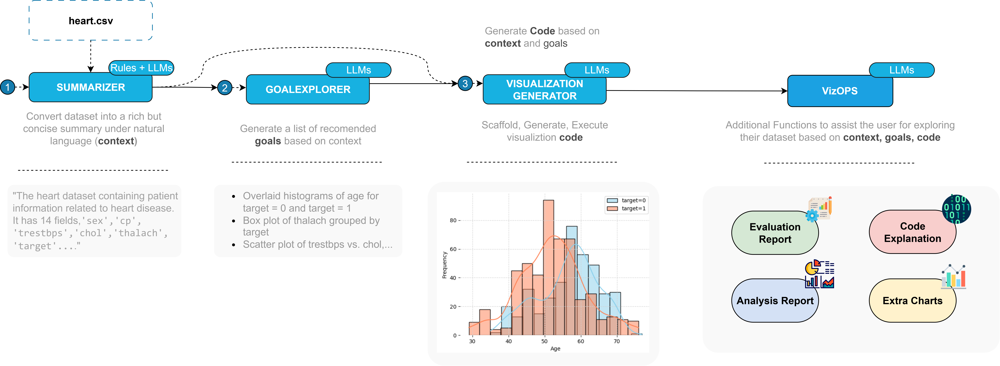

# NTViz: Next-Gen Data Visualization Recommendation System


**NTViz** is a next-generation data visualization recommendation system designed to solve this problem. It automatically suggests the most suitable chart types based on the user's dataset and intent. Our system builds upon and extends the capabilities of the open-source library [**LIDA**](https://github.com/microsoft/lida/tree/main/lida). 

With a user-oriented approach, we have modified and added new functions to better serve and satisfy non-technical users.

## ✪ Functions
**NTViz** takes input in `.csv` format and leverages the power of Large Language Models (LLMs) to provide intelligent, user-friendly data exploration features. The core functionalities include:

- **Data Summarization**: Combines rule-based methods to compute key variable statistics with LLMs to generate natural language summaries of the dataset.
- **Visualization Recommendation**: Suggests the most appropriate chart types based on the data summary and the suitable goals.
- **User Query-Based Graph**: Creates visualizations from natural language queries (e.g., "show sales trends by year").
- **Extra Visualization**: Proposes additional charts for deeper analysis.
- **Code Explainer**: Translates Python visualization code into clear, human-readable explanations.
- **Code Evaluator**: Reviews and scores based on code and visualization images.
- **Chart Analyst**: Analyzes generated charts to extract insights and trends using a RAG-based multimodal pipeline that ingests relevant documents for context. 

## 🧩 Usage
To use our system from your local computer, you need to fork this repo and pull it into your pc or lap. Our tutorial is in this [notebook](notebook/tutorial.ipynb).
**NTViz** relied on llmx-gemini and Gemini. Especially, our system depends on mostly Gemini. Therefore, we updated the original llmx into llmx-gemini to use Google API. You need to install them through:
```python
pip install git+https://github.com/tramphan748/llmx-gemini.git
```

Defining the orchestor named Manager to provide your API KEY from [Google AI Studio](https://aistudio.google.com/apikey) and configure the text generation. 
```python
from ntviz import Manager, TextGenerationConfig , llm  
ntviz = Manager(text_gen = llm("gemini", api_key="your_api_key")) # input api key
textgen_config = TextGenerationConfig(n=1, temperature=0.7,  model="gemini-1.5-flash", use_cache=True)
```

As introduced in the function section, you can use our modules:

### Data Summarization
```python
summary = ntviz.summarize(df, textgen_config=textgen_config)  
```

### Visualization Generation
```python
# Generate the list of Goals to orient the system what to visualize
goals = ntviz.goals(summary, n=5, textgen_config=textgen_config)

for goal in goals:
    display(goal)

# Execute code
visuals = []
images = []
for i in range(5):
    visual = []
    charts = ntviz.visualize(summary = summary, goal = goals[i], library = 'seaborn') # you can choose another visualization library such as matplotlib, plotly,...
    for chart in charts:
        visual = charts[0].code
        display(chart)
        buf = io.BytesIO()
        plt.savefig(buf, format="png", dpi=600, bbox_inches="tight")
        buf.seek(0)
        plot_data = base64.b64encode(buf.read()).decode("ascii")
        images.append(plot_data) 
        plt.close()  
        visuals.append(visual)
```

### User Query Based Graph
```python
user_query = "New York is hotter than Seattle?"
query = ntviz.visualize(summary=summary, goal=user_query, textgen_config=textgen_config)  
```

### Extra Visualization
```python
extra_charts =  ntviz.extra(code=code, summary=summary, n=5, textgen_config=textgen_config)
```

### Code Explainer
```python
explanations = ntviz.explain(code=code, library=library, textgen_config=textgen_config) 
for row in explanations[0]:
    print(row["section"]," ** ", row["explanation"])
```

### Code Evaluator
```python
evaluations = ntviz.evaluate(code=code,
                             image=img,  
                             goal=goals[2], 
                             textgen_config=textgen_config, 
                             library=library)[0] 
for eval in evaluations:
    aspect = eval["aspect"]  # "code" or "visual"
    print(f"{aspect.upper()} EVALUATION")  
    avg = eval["average"]
    print(f"Average Score: {avg}/10") 

    for evaluation in eval["evaluations"]:
        dimension = evaluation["dimension"]  
        score = evaluation["score"]  
        rationale = evaluation["rationale"]  

        print(f"- {dimension.capitalize()} Score: {score}/10")
        print(f"  {rationale[:200]}...") 
        print("  ----------------------------------")

    print("\n")
```

### Chart Analyst
```python
# Track the generated charts 
executed_viz = ntviz.execute( code_specs=visuals, data=df, summary=summary, library="seaborn")

# Generate a comprehensive report
analysis_report = ntviz.analyze(chart=executed_viz[0], df = df, summary= summary, textgen_config= textgen_config)
```

## 🌐 Web
Our primary objective is to help non-technical users create meaningful visualizations with ease. To support this, we developed a user-friendly and comprehensive web interface that allows users to interact with the system directly without needing to fork or run the code locally.

✷ Streamlit app: [ntz-recommend.streamlit.app](https://ntz-recommend.streamlit.app/)


## 🔖 References
We would like to acknowledge the following outstanding works that inspired or supported this project.
```bibtex
@article{dibia2023lida,
  title={LIDA: A tool for automatic generation of grammar-agnostic visualizations and infographics using large language models},
  author={Dibia, Victor},
  journal={arXiv preprint arXiv:2303.02927},
  year={2023}
}

@software{victordibiallmx,
    author = {Victor Dibia},
    license = {MIT},
    month =  {10},
    title = {LLMX - An API for Chat Fine-Tuned Language Models},
    url = {https://github.com/victordibia/llmx},
    year = {2023}
}

```
